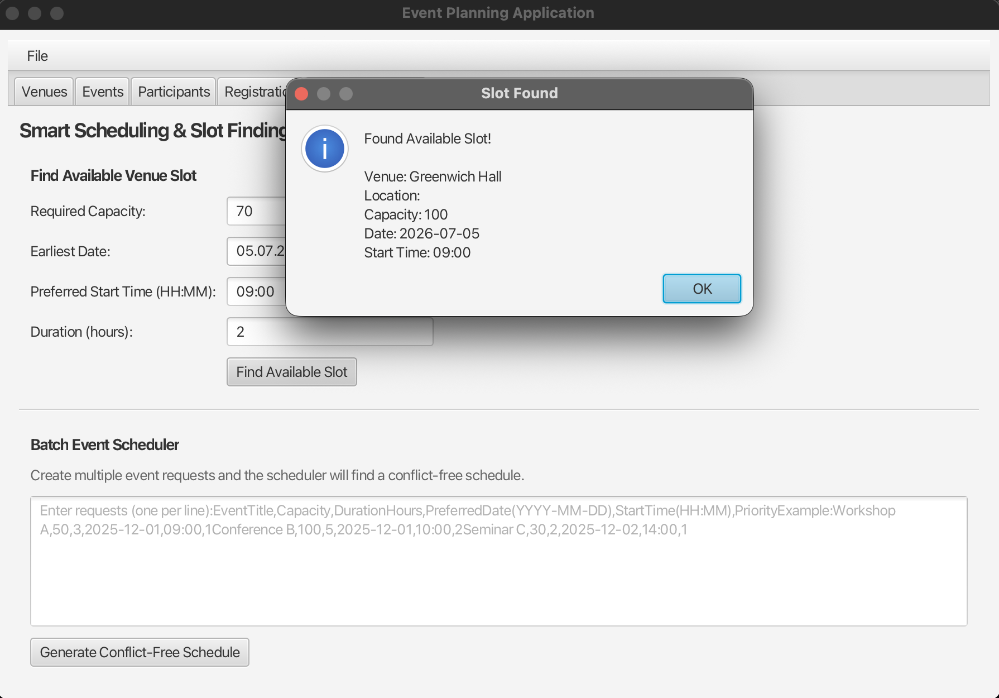
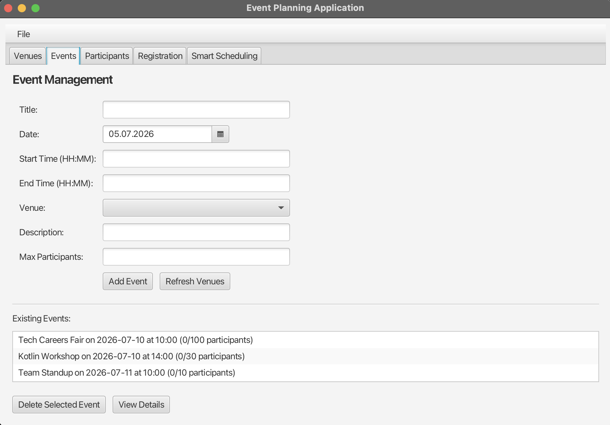

# Event Planner — Kotlin + Scala on the JVM

Desktop event-planning application built as JVM-module coursework (University of Greenwich). The interesting part isn't the CRUD — it's that **two JVM languages share one codebase**: Kotlin owns the application (JavaFX UI, domain, JSON persistence), while the scheduling algorithms are written in functional Scala and called from Kotlin through a typed interop bridge.



## What it does

Manage venues, events, and participant registrations through a JavaFX desktop UI — plus two "smart" features powered by the Scala modules:

- **Slot finder** — given required capacity, earliest date, preferred time and duration, finds the first venue slot with no time-overlap conflicts, scanning up to 30 days ahead
- **Batch scheduler** — takes a list of event requests with priorities and produces a conflict-free schedule (greedy allocation: higher priority first, then earliest preferred date), reporting anything it couldn't place and why



## Why two languages, and how they talk

The module required demonstrating JVM language interop — the design choice was *what to put where*:

- **Scala** (`src/main/scala`) — pure scheduling logic, no UI or IO. It plays to Scala's strengths: immutable `case class`es, `Option` instead of nulls, a `LazyList` generating an infinite stream of candidate dates, for-comprehensions for the search, and `foldLeft` accumulating the schedule
- **Kotlin** (`src/main/kotlin`) — everything else: JavaFX views, domain model, JSON persistence (kotlinx.serialization with a custom `LocalDate` serializer)
- **The bridge** (`ScalaIntegration.kt`) — Kotlin services convert domain objects to Scala case classes via `scala.jdk.javaapi.CollectionConverters`, call the Scala objects, and map results (including `Option` → nullable) back to idiomatic Kotlin data classes, so the rest of the app never touches Scala types

The non-obvious part was the **build**: Gradle's default task wiring creates a circular dependency in mixed Scala/Kotlin projects. `build.gradle.kts` breaks it by making `compileScala` independent, then compiling Kotlin with Scala's output on its classpath (Scala → Kotlin → Java).

## Stack

Kotlin 2.0 · Scala 2.13 · JavaFX 21 · kotlinx.serialization · Gradle (Kotlin DSL) · JVM 17

## Structure

```
src/main/kotlin/com/eventplanner/
├── ui/               # JavaFX views (venues, events, participants, registration, scheduling)
├── domain/           # Event, Venue, Participant, EventManager, ScalaIntegration bridge
└── persistence/      # JSON DataStore (kotlinx.serialization)
src/main/scala/com/eventplanner/
├── slotfinder/       # SlotFinder — first-available-slot search
└── scheduler/        # EventScheduler — priority-based conflict-free scheduling
```

## Running it

```bash
./gradlew run
```

Requires JDK 17+. Data persists to a local JSON file between sessions.

---

**Author:** Vladyslav Danyliuk — BSc Software Engineering, University of Greenwich
[GitHub](https://github.com/VladDanyliuk)
